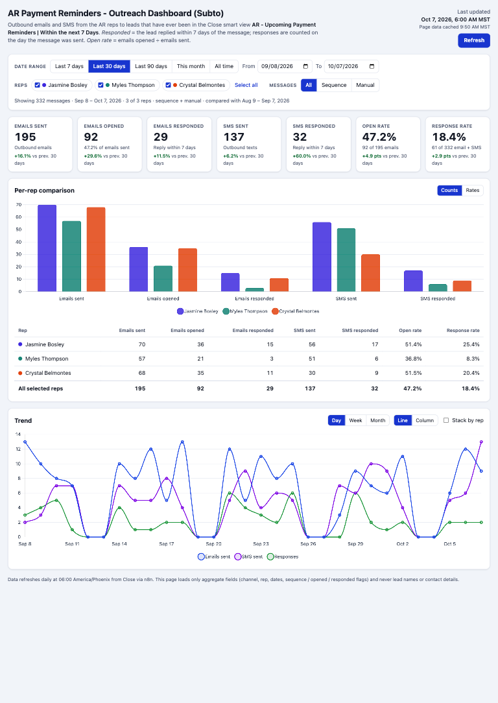
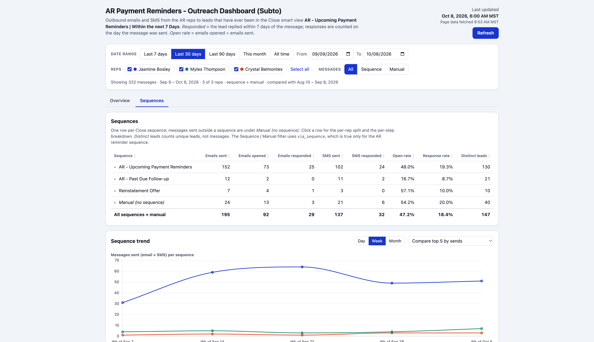

# AR Payment Reminders - Outreach Dashboard (Subto)

An internal dashboard, built as a Google Apps Script web app, showing how the AR reps
(Jasmine Bosley, Myles Thompson, Crystal Belmontes) are working the payment-reminder list:
emails and SMS sent, emails opened, replies, and open and response rates. The **Overview** tab
covers totals, per-rep figures and trends over time; the **Sequences** tab breaks the same
messages down by Close sequence, step and manual message.

- **Who can open it:** only people signed in with a New Reach Google Workspace account
  (`newreacheducation.com`; `newreach.com` is an alias of it). Access is enforced by Google
  through `webapp.access = DOMAIN`.
- **Whose permissions it reads with:** the deployer's (`hailey@newreach.com`), through
  `executeAs = USER_DEPLOYING`. Viewers don't need access to the sheet.
- **Data source:** the sheet `AR Payment Reminders - Outreach Dashboard (Subto)`
  (`13ZrIQkxulhjES49I8i36VtJ-jiY_A_kv1NxraHERrYs`), tab `messages` (gid `2122950652`).
  A live n8n workflow refreshes it daily at **06:00 America/Phoenix**.



## Data definitions

Each row of the `messages` tab is one outbound email or SMS from one of the AR reps to a lead
that has **ever** been in the Close smart view
**AR - Upcoming Payment Reminders | Within the next 7 Days**.

| Metric | Definition |
|---|---|
| Emails sent | rows with `channel = email` |
| Emails opened | email rows with `opened = TRUE` |
| Emails responded | email rows with `responded = TRUE` |
| SMS sent | rows with `channel = sms` |
| SMS responded | SMS rows with `responded = TRUE` |
| Open rate | emails opened ÷ emails sent |
| Response rate | (emails responded + SMS responded) ÷ (emails sent + SMS sent) |

- **Responded** means the lead replied within 7 days of that message. A response is counted
  on the day the message was **sent**, not the day of the reply, so recent days fill in as
  the 7-day window closes.
- **Sequence / Manual** filters on `via_sequence` (TRUE = sent by a Close sequence).
- **Day / Week / Month** buckets on `date`, `week_start` (the Monday) and `month`.
- **Change vs previous period:** when both ends of the date range are set, each KPI card
  compares against the period of equal length that ends the day before the range starts.
  For example, Oct 1–7 is compared with Sep 24–30. Counts show a percent change; rates show
  the change in percentage points. "All time" shows no comparison.
- **Last updated** is the latest `last_checked` value in the sheet, which is when n8n last
  refreshed it. "Page data cached / fetched" is when the web app last read the sheet.
- Booleans from the sheet can arrive as real booleans or as the strings `TRUE` / `FALSE` /
  `true`. Both are normalized. `opened` is always false for SMS.

### Sequences tab



The date range, rep and Sequence / Manual filters apply here too. Note that the Sequence /
Manual filter still means `via_sequence`, which is TRUE only for the AR reminder sequence, so
**Manual** includes the other sequences.

- **Sequences table**: one row per `sequence_name`, plus **Manual (no sequence)** for rows with
  an empty `sequence_name` (always listed last). Same counts and rates as the Overview, plus
  **Distinct leads** = unique `lead_key` values. Click a column to sort; click a row for the
  per-rep split and a per-step breakdown (`step_label`, falling back to `template_label`).
- **Sequence trend**: Day / Week / Month, for one sequence (emails, SMS, responses) or the
  top 5 sequences by sends compared.
- **Top 10 manual messages**: non-sequence rows grouped by `manual_label` and ranked by sends.
  `Template: …` groups always count. A free-text group appears only if it reached **3 or more
  distinct leads** within the current filters; smaller ones are summed into **Other one-off
  manual messages**. An empty `manual_label` is shown as **Unlabeled**. Both roll-ups are
  listed under the top 10, not ranked in it.
- **Missing columns**: until the sheet has all five sequence columns, the Sequences tab shows
  *Sequence data not available yet* (the Overview still works). It shows the same note if the
  columns exist but no row has been filled yet.

### Privacy

`getDashboardData()` reads the whole tab on the server but sends the browser **only** these
thirteen fields per row, as compact arrays:

```
channel, user_name, date, week_start, month, via_sequence, opened, responded,
sequence_name, template_label, step_label, manual_label, lead_key
```

Besides the rows, the payload carries only `fields`, `row_count`, `skipped_rows`,
`missing_columns` (which of the five sequence columns the sheet lacks), `last_updated`,
`generated_at` and `from_cache`. Lead names, lead IDs, activity IDs, `sequence_id`,
`template_id`, phone numbers, email addresses and raw message text never leave the server, and
there is no lead-level table. `lead_key` is n8n's 12-hex non-reversible hash; anything else in
that column is sent as blank. As a second guard behind n8n's normalization, the server strips
email addresses and phone numbers from all labels, removes `$` amounts, digits and the row's
own lead name from free-text `manual_label`s, and caps labels at 100 characters.
`tests/aggregation.test.js` checks this.

### Caching

The payload is cached in `CacheService` (script cache) for **10 minutes**. It is split into
chunks of up to 50 KB, because each cache value is capped at 100 KB and the sheet grows by
tens of rows a day. **Refresh** in the header calls `getDashboardData(true)`, which bypasses
the cache, re-reads the sheet and re-caches the result. The cache key is versioned
(`ar_outreach_payload_v2`), so a payload cached by an older deployment is never served.

## File layout

```
ar-outreach-dashboard/
├── src/                      ← everything clasp pushes (rootDir)
│   ├── appsscript.json       manifest: V8, America/Phoenix, DOMAIN access, execute as deployer, spreadsheets.readonly, Sheets advanced service
│   ├── Code.gs               CONFIG, doGet, include(), getDashboardData(forceRefresh), privacy filter, chunked cache
│   ├── Index.html            page markup; pulls in Styles / Metrics / App with <?!= include() ?>; Chart.js 4.4.1 from jsDelivr (SRI-pinned)
│   ├── Styles.html           CSS (responsive; no framework)
│   ├── Metrics.html          pure aggregation: normalize, filter, summarize, per-rep, periods, trend buckets, sequences, top manual messages
│   └── App.html              UI: state, filters, Overview / Sequences tabs, KPI cards, charts, loading / empty / error states
├── preview/
│   ├── stub.js               fake google.script.run that returns SYNTHETIC rows
│   └── index.html            GENERATED: src/Index.html with includes inlined + stub (do not edit)
├── scripts/build-preview.js  builds preview/index.html; --check fails if it has drifted from src/
├── tests/aggregation.test.js plain-Node unit checks for Code.gs + Metrics.html
├── docs/screenshots/         preview screenshots (synthetic data)
├── .clasp.json.example       template for .clasp.json (scriptId + rootDir: src)
├── package.json              npm scripts only; no dependencies
└── .gitignore                ignores .clasprc.json, node_modules, local or real data exports
```

`Metrics.html` is separate from `App.html` so the Node test can load the exact aggregation
code the browser runs.

## Local preview and tests

Requires Node 18+ and Python 3. Nothing to install.

```bash
npm test                 # unit checks + verifies preview/index.html is in sync with src/
npm run build:preview    # regenerate preview/index.html after editing anything in src/
npm run preview          # rebuild, then serve on http://127.0.0.1:8765/preview/index.html
```

Preview query options: `?state=error`, `?state=empty`, `?state=slow`, `?state=noseq` (sheet
without the sequence columns), `?delay=<ms>`, `?days=<n>`, `?seed=<n>`. The preview uses made-up rows only. It loads Chart.js from the CDN,
so it needs internet access.

## Deploy

Deployment needs a Google login as **hailey@newreach.com** (the Workspace account behind
the alias), which must have at least view access to the sheet.

### First-time authorization (both paths)

The web app runs as the deployer, so the deployer must grant the
`spreadsheets.readonly` scope once:

1. Open the project in the Apps Script editor (`clasp open-script`, or
   [script.google.com](https://script.google.com)).
2. Select `getDashboardData` in the function dropdown, click **Run**, and accept the consent
   screen. If it shows "unverified app", choose *Advanced → Go to …*; it's an internal script.

Deploying from the editor UI also prompts for this. Deploying with clasp alone does not.

> **Why the Sheets Advanced Service:** `Code.gs` reads the tab with `Sheets.Spreadsheets`
> (Sheets API v4, enabled in `appsscript.json`) instead of `SpreadsheetApp`, because
> `SpreadsheetApp` rejects the `spreadsheets.readonly` scope and demands full read/write
> access. Any change to `oauthScopes` or `enabledAdvancedServices` invalidates the existing
> grant: re-run `getDashboardData` in the editor and accept the consent screen again before
> the web app will load.

### (a) With clasp

1. Turn on the Apps Script API for your account:
   <https://script.google.com/home/usersettings> → *Google Apps Script API* → **On**.
2. Install and log in:
   ```bash
   npm i -g @google/clasp
   clasp login            # browser opens; sign in as hailey@newreach.com
   ```
   This writes your OAuth token to `~/.clasprc.json`. Never commit that file.
3. Link this folder to a script project. Pick one:
   - **New project**:
     ```bash
     clasp create --type webapp --title "AR Payment Reminders - Outreach Dashboard (Subto)" --rootDir src
     git checkout -- src/appsscript.json   # clasp overwrites the manifest with a default; restore ours
     ```
     (clasp 3 also accepts `clasp create-script` with the same flags.)
   - **Existing project**: copy the template and paste the Script ID (*Project Settings →
     IDs* in the editor):
     ```bash
     cp .clasp.json.example .clasp.json   # then edit scriptId
     ```
   `.clasp.json` holds only the script ID and `rootDir`, so it's safe to commit.
4. Push the code: `clasp push` (answer **yes** if asked to overwrite the manifest).
5. Do the one-time authorization above.
6. Create the deployment:
   ```bash
   clasp deploy --description "v1"      # clasp 3: clasp create-deployment --description "v1"
   clasp deployments                    # clasp 3: clasp list-deployments
   ```
   `appsscript.json` sets access and the execute-as user, so no UI choices are needed.

### (b) Manual copy-paste in script.google.com

1. Go to <https://script.google.com> → **New project**. Rename it
   `AR Payment Reminders - Outreach Dashboard (Subto)`.
2. *Project Settings* (gear) → tick **Show "appsscript.json" manifest file in editor**, and
   set the time zone to *(GMT-07:00) Phoenix*.
3. Replace the contents of `Code.gs` and `appsscript.json` with the files from `src/`.
4. Add four HTML files with **+ → HTML** named exactly `Index`, `Styles`, `Metrics`, `App`
   (the editor adds `.html`), and paste in each file's contents.
5. Save, then do the one-time authorization above.
6. **Deploy → New deployment** → type **Web app**:
   - *Execute as*: **Me (hailey@newreach.com)**
   - *Who has access*: **Anyone within New Reach** (the Workspace domain)
   
   → **Deploy**.

### Where the URL is

- After **Deploy → New deployment**, the dialog shows the **Web app URL**
  (`https://script.google.com/a/macros/newreacheducation.com/s/<deploymentId>/exec`). Share
  that URL.
- You can find it later under **Deploy → Manage deployments**. `clasp deployments` lists
  the deployment IDs; put the ID into the URL above.
- **Deploy → Test deployments** gives a `/dev` URL that always runs the latest saved code.
  Only editors can use it.

### Redeploying (same URL)

Every new deployment gets a new URL. To ship changes without changing the shared link,
update the existing deployment:

- **UI**: **Deploy → Manage deployments** → pencil icon on the web-app deployment →
  *Version*: **New version** → **Deploy**.
- **clasp**:
  ```bash
  clasp push
  clasp deploy --deploymentId <deploymentId> --description "what changed"
  # clasp 3: clasp update-deployment <deploymentId> --description "what changed"
  ```

Before pushing, run `npm test` and check the preview.

## Troubleshooting

- **"Couldn't load the dashboard data" mentioning permissions**: the deployer hasn't
  authorized the script yet (see first-time authorization), or has lost access to the sheet.
- **"Could not find the messages tab"**: the tab's gid changed and no tab is named
  `messages`. Update `CONFIG.SHEET_GID` in `Code.gs`.
- **"missing required column(s)"**: the header row no longer has `channel`, `user_name`
  or `date`. Columns are looked up by header name, so reordering them is fine.
- **Sequences tab says "Sequence data not available yet"**: the `messages` tab is missing one
  of `sequence_name`, `template_label`, `step_label`, `manual_label`, `lead_key` (the note lists
  which), or none of those cells are filled yet. Fix the n8n refresh, then click **Refresh**.
- **"Anyone within New Reach" isn't offered**: a Workspace admin may have restricted web-app
  sharing for the domain.
- **Charts say Chart.js could not load**: the network is blocking `cdn.jsdelivr.net`. The
  KPI cards and table still work.
- **Numbers look stale**: click **Refresh**, which bypasses the 10-minute cache. If **Last
  updated** is more than a day old, check the n8n refresh workflow.
